```{r setup, include=FALSE}
knitr::opts_chunk$set(echo = FALSE, fig.align = "center",
                      warning = FALSE, message = FALSE,
                      fig.width = 10, fig.height = 6)
```

# Outline

.pull-left[
**Part I — EBNMF methods** (~30 min)

1\. Empirical Bayes in bioinformatics

2\. The EBNM problem

3\. Prior families

4\. EBNMF and `flashier`

5\. GBCD for multi-sample scRNA-seq
]

.pull-right[
**Part II — Case study** (~25 min)

6\. COVID-19 proteomics: NMF variants

7\. From stacking to DIVAS

**Q&A** (~5 min)
]

---
class: inverse, center, middle

# Part I: Foundations

---

# You are already using empirical Bayes

Many familiar bioinformatics tools use **the same core idea**:

| Tool | What it shrinks | Prior estimated from |
|------|----------------|---------------------|
| **limma** | Gene-wise variances $s_j^2$ | All genes' variance estimates |
| **edgeR / DESeq2** | Dispersion $\phi_j$ | Dispersion trend across genes |


**The pattern:**

1. Many noisy estimates $\hat{\theta}_1, \ldots, \hat{\theta}_n$
2. They share a common distribution (the **prior** $g$)
3. **Estimate** $g$ from data, hence *empirical* Bayes
4. Posterior: shrink each $\hat{\theta}_i$ towards $\hat{g}$

**EBNM** formalises this for normal observations → **EBNMF** extends it to matrices.

---

# The EBNM problem

**Model:** Observe $n$ noisy measurements with known standard errors:

$$x_i \sim \mathcal{N}(\theta_i, s_i^2), \quad i = 1, \ldots, n$$

**Goal:** Estimate the true means $\theta_i$, each based on $n=1$

**Maximum likelihood estimation:** $\hat\theta_i = x_i$ [of course]

**Empirical Bayes approach:** Assume $\theta_i \sim g$ [prior distr taking a certain form], then:

1. **Estimate** $g$ by maximising the marginal likelihood [empirical part of EB]:
$$\hat{g} = \arg\max_{g \in \mathcal{G}} \prod_{i=1}^n \int p(x_i \mid \theta_i, s_i) \, g(\theta_i) \, d\theta_i$$

2. **Shrink** via posterior mean: $\hat{\theta}_i = \mathbb{E}[\theta_i \mid x_i, s_i, \hat{g}]$ [Standard Bayes, except for estimated prior]

---

# Why shrinkage works

Imagine 500 genes: 490 null ( $\theta_i = 0$ ), 10 with real effects.

.pull-left[
**Normal prior** → linear shrinkage:
all estimates pulled towards $\hat{\mu}$ by the same proportion $\frac{\hat{\sigma}^2}{\hat{\sigma}^2 + s^2}$.

**Spike-and-slab priors** (point-normal, point-Laplace) → **nonlinear** shrinkage:
observations near zero are collapsed to exactly zero;
large observations survive nearly intact.
]

.pull-right[
```{r shrinkage-plot, echo=FALSE, fig.height=5, fig.width=6}
library(ggplot2)
x_vals <- seq(-4, 4, length.out = 200)
sigma2 <- 1; s2 <- 1
# Point-normal posterior mean (approximate): soft-thresholding
pi0 <- 0.9
pn_post <- sapply(x_vals, function(xi) {
  w0 <- pi0 * dnorm(xi, 0, sqrt(s2))
  w1 <- (1 - pi0) * dnorm(xi, 0, sqrt(sigma2 + s2))
  p0 <- w0 / (w0 + w1)
  (1 - p0) * (sigma2 / (sigma2 + s2)) * xi
})
df <- data.frame(
  x = rep(x_vals, 3),
  Estimate = c(x_vals,
               (sigma2 / (sigma2 + s2)) * x_vals,
               pn_post),
  Estimator = rep(c("MLE", "Normal prior (linear)",
                    "Point-normal (nonlinear)"), each = 200)
)
ggplot(df, aes(x = x, y = Estimate, colour = Estimator, linetype = Estimator)) +
  geom_line(linewidth = 1.2) +
  geom_hline(yintercept = 0, colour = "grey70") +
  scale_colour_manual(values = c("tomato", "steelblue", "forestgreen")) +
  scale_linetype_manual(values = c("solid", "dashed", "solid")) +
  labs(x = expression(x[i]), y = expression(hat(theta)[i]),
       title = "Linear vs nonlinear shrinkage") +
  theme_classic(base_size = 16) +
  theme(legend.position = "bottom", legend.title = element_blank())
```
]

---

# Prior families in `ebnm`

The choice of prior $\mathcal{G}$ controls shrinkage behaviour.

| Prior | Support | Sparsity | Typical use |
|-------|---------|----------|-------------|
| Normal | $\pm$ | None | PCA-like, dense factors |
| Point-normal | $\pm$ | Moderate | Sparse signed loadings |
| Point-Laplace | $\pm$ | Moderate | DE log-fold changes |
| Point-exponential | $+$ only | Strong | NMF loadings |

```{r prior-shapes, echo=FALSE, fig.height=4, fig.width=8}
library(ggplot2); library(patchwork)
x <- seq(-4, 4, length.out = 400)

p1 <- ggplot(data.frame(x = x, y = dnorm(x, 0, 1)), aes(x, y)) +
  geom_line(colour = "steelblue", linewidth = 1.2) +
  labs(title = "Normal", x = expression(theta), y = "Density") +
  theme_classic(base_size = 14)

p2 <- ggplot(data.frame(x = x, y = 0.7 * dnorm(x, 0, 1.5)), aes(x, y)) +
  geom_line(colour = "darkorange", linewidth = 1.2) +
  geom_segment(aes(x = 0, xend = 0, y = 0, yend = 0.5),
               colour = "darkorange", linewidth = 2) +
  labs(title = "Point-normal", x = expression(theta), y = "") +
  theme_classic(base_size = 14)

x_pos <- seq(0, 4, length.out = 200)
p3 <- ggplot(data.frame(x = x_pos, y = 0.6 * dexp(x_pos, rate = 1)), aes(x, y)) +
  geom_line(colour = "forestgreen", linewidth = 1.2) +
  geom_segment(aes(x = 0, xend = 0, y = 0, yend = 1),
               colour = "forestgreen", linewidth = 2) +
  labs(title = "Point-exponential", x = expression(theta), y = "Density") +
  theme_classic(base_size = 14)

dlaplace <- function(x, b = 1) exp(-abs(x) / b) / (2 * b)
p4 <- ggplot(data.frame(x = x, y = 0.7 * dlaplace(x, b = 1.5)), aes(x, y)) +
  geom_line(colour = "purple", linewidth = 1.2) +
  geom_segment(aes(x = 0, xend = 0, y = 0, yend = 0.5),
               colour = "purple", linewidth = 2) +
  labs(title = "Point-Laplace", x = expression(theta), y = "") +
  theme_classic(base_size = 14)

(p1 + p2 + p3 + p4) +
  plot_annotation(subtitle = "Spike at zero = exact sparsity; slab shape = how non-zero signals are distributed")
```

---

# EBMF: from vectors to matrices

**The model:** Decompose an $n \times p$ data matrix as

$$\mathbf{X} = \mathbf{L}\mathbf{F}^\top + \mathbf{E}$$

- $\mathbf{L}$ ( $n \times K$ ): sample/cell loadings — *how much* each sample participates in each program
- $\mathbf{F}$ ( $p \times K$ ): gene/protein weights — *which features* define each program
- $\mathbf{E}$: Gaussian noise

**Warning:** highly unconventional use of 'loadings'

**EB priors** on each column of $\mathbf{L}$ and $\mathbf{F}$:

$$\ell_{ik} \sim g_\ell^{(k)}, \qquad f_{jk} \sim g_f^{(k)}$$

The prior family determines the decomposition type (next slide).

---

# Prior choice → decomposition type

| Prior on L | Prior on F | Result |
|-----------|-----------|--------|
| Normal | Normal | PCA-like |
| Point-normal | Point-normal | Sparse MF |
| **Point-exponential** | **Point-exponential** | **NMF** |
| Point-exponential | Point-Laplace | Semi-NMF (non-neg L, signed F) |
| Generalised binary | Point-Laplace | **GBCD** |


**Key insight:** Same algorithm (`flashier`), different priors → fundamentally different decompositions.

Sparsity is **learned per factor** from the data (not a hyperparameter such as $\lambda$ in lasso).

---

# The `flash()` algorithm

```
K=0 ──greedy──► K=1 ──greedy──► K=2 ──···──► K*
                                               │
                                            backfit
                                               │
                                         K* (refined) ──nullcheck──► K** (final)
```

1. **Greedy addition:** Find best rank-1 approximation to residual $\mathbf{R}$.
   Accept if it improves the ELBO. Repeat up to `greedy_Kmax`.

2. **Backfit:** Cycle through all $K$ factors, re-estimate each given all others.

3. **Null check:** Remove any factor whose deletion improves ELBO.


**Result:** $K$ is selected automatically — no need to specify in advance.

Link to EBNM: Each update step is an EBNM problem fixing $\mathbf{F}$ (see EBNMF.md)

---

# `flash()` in practice

```r
library(flashier); library(ebnm)
fit <- flash(
* data        = X,                        # n × p (samples × genes)
* ebnm_fn     = ebnm_point_exponential,   # NMF: non-negative L and F
  greedy_Kmax = 30,
  backfit     = TRUE,
  nullcheck   = TRUE
)
```

**Key outputs:**

| Field | Dimensions | What it gives you |
|-------|-----------|------------------|
| `fit$L_pm` | $n \times K$ | Sample loadings (posterior means) |
| `fit$F_pm` | $p \times K$ | Gene/protein weights |
| `fit$n_factors` | scalar | Auto-selected $K$ |
| `fit$pve` | length $K$ | Variance explained per program |

---

# Interpreting NMF output

.pull-left[
**Top genes in program $k$:**
```r
k <- 1
gene_ranks <- order(fit$F_pm[, k],
                    decreasing = TRUE)
top_genes <- rownames(fit$F_pm)[gene_ranks[1:20]]
```
]

.pull-right[
**When input is log1p(counts):**

$F_{jk}$ approximates the log-fold change of gene $j$ between cells with loading = 1 vs loading = 0.

**Asymmetric priors:**
```r
# Non-negative L, signed F
fit <- flash(
  X,
* ebnm_fn = list(ebnm_point_exponential,
*                ebnm_point_laplace)
)
```

F can now have negative weights (genes down-regulated in a program).
]


---

# GBCD: motivation

**Motivation:** forcing membership ('sample/cell loadings') to be close to 0 or 1 (binary-like) 


**GBCD** (Liu et al., *Nature Genetics* 2025) addresses this with:

1\. **Generalised binary prior:** $\ell_{ik} \approx 0$ or $\approx 1$
   (cell is "in" or "out" of each program)
   
   $$l_{ik} \sim (1 - \pi_k)\,\delta_0 + \pi_k\, \mathcal{N}_+(\mu_k, \sigma_k^2)$$
- Spike at zero: cell does **not** participate in program $k$
- Truncated normal slab with small $\sigma_k / \mu_k$ (default 0.1): memberships cluster near $\mu_k$
- **Rescale** membership to be close to 0 or 1


2\. **Orthogonal factors:** gene expression programs are independent (PVE summing to 1) 


Model fitting: see EBNMF.md


---

# GBCD in practice

```r
* library(gbcd)
* fit <- fit_gbcd(
  Y        = Y,          # n × p, shifted-log-normalised counts
  Kmax     = 15,         # upper bound; null check prunes
  prior    = ebnm::ebnm_generalized_binary,
  verbose  = 1
)
```

```r
L    <- fit$L            # n × K: binary-like memberships
F_lfc <- fit$F$lfc       # p × K: gene LFCs per program
F_lfsr <- fit$F$lfsr     # p × K: local false sign rates
```

---
class: inverse, center, middle

# Part II: Case Study
## COVID-19 Longitudinal Proteomics

---

# The dataset

**COVID-19 multiomics cohort** (Su et al., *Cell* 2020)

- **481 proteins** (Olink PEA) × **120 patients** × **2 time points** (T1: admission, T2: follow-up)
- WHO severity score: 1 (mild) → 7 (critical)


**Question:** Can NMF identify protein programs associated with disease severity?

**Approach:** Stack T1 and T2 as rows → single matrix (240 × 481) → run NMF variants

$$\mathbf{X}_{\text{stacked}} = \begin{pmatrix} \mathbf{X}_{T1} \\ \mathbf{X}_{T2} \end{pmatrix} \in \mathbb{R}^{240 \times 481}$$

---

# Four NMF variants compared

| Variant | Prior on L | Prior on F | K | Method |
|---------|-----------|-----------|---|--------|
| **S1** | Standard NMF | Standard NMF | 8 (fixed) | `NMF::nmf()` |
| **S2** | Point-exponential | Point-exponential | 14 (auto) | `flashier` |
| **S3** | Point-exponential | Point-Laplace | 15 (auto) | `flashier` |
| **S4** | Generalised binary | Point-Laplace | 8 (auto) | `gbcd` |


```r
# S1: Standard NMF
fit_S1 <- NMF::nmf(t(X_shifted), rank = 8, method = "brunet", nrun = 10)

# S2: EBNMF — non-negative L and F, auto K
fit_S2 <- flash(X_shifted, ebnm_fn = ebnm_point_exponential, greedy_Kmax = 15)

# S3: Asymmetric — non-negative L, signed F
fit_S3 <- flash(X_prot, ebnm_fn = list(ebnm_point_exponential, ebnm_point_laplace))

# S4: GBCD — binary-like L, signed F
fit_S4 <- fit_gbcd(X_prot, Kmax = 15)
```

---


# EBNMF: structure plot and loading heatmap

Double point-exponential (both $L$ and $F$) results.

.pull-left[
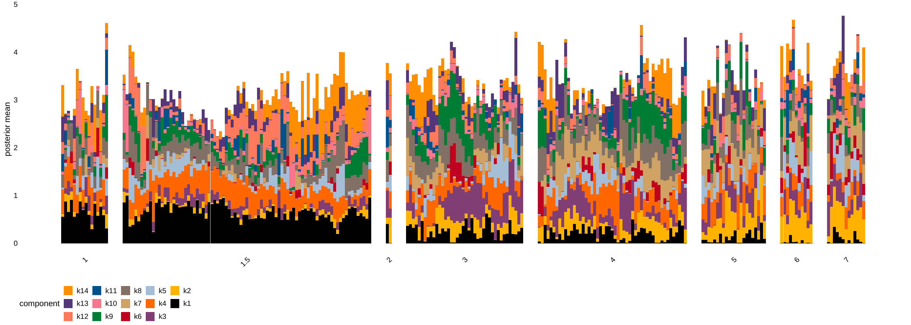

**Structure plot:** patients ordered by severity. Each bar = one patient; colours = K=14 programs. Program membership is **continuous** (graded bars).
]

.pull-right[
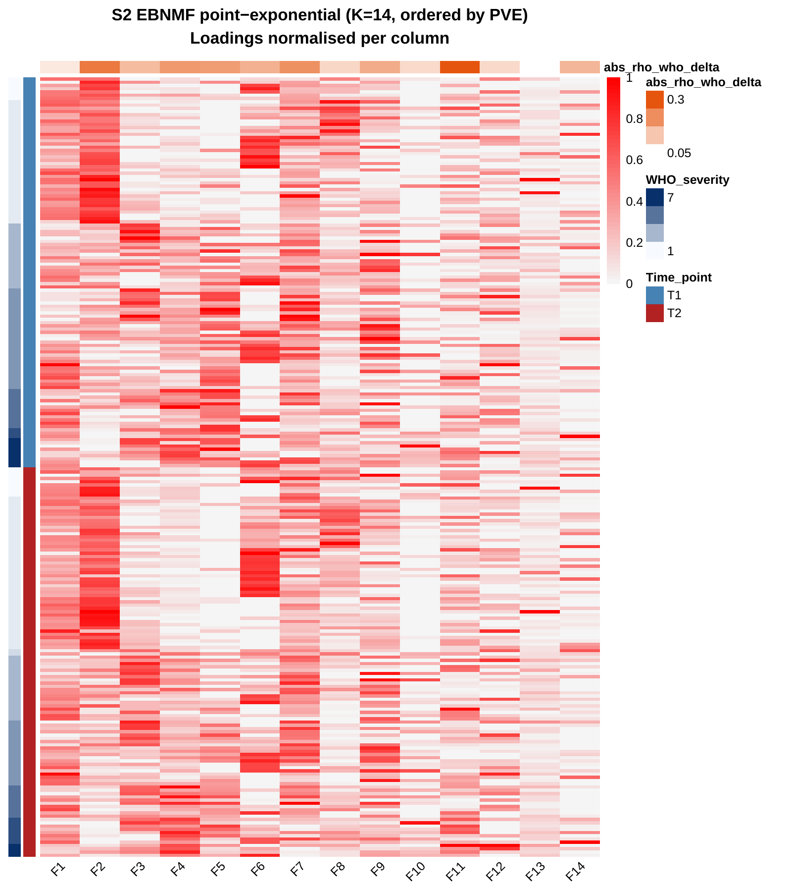

**Loading heatmap:** rows = patients (T1 then T2, ascending severity); columns = programs ordered by PVE.
]

---

# Comparing loading heatmaps: effect of prior choice

.pull-left[
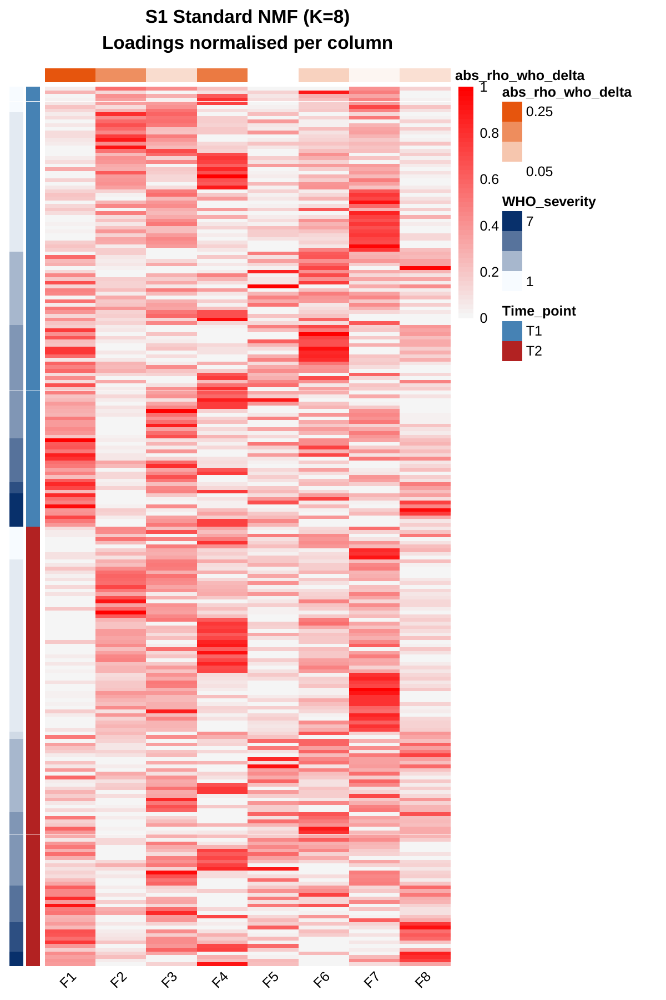

**S1 Standard NMF** (K=8, fixed). Dense.

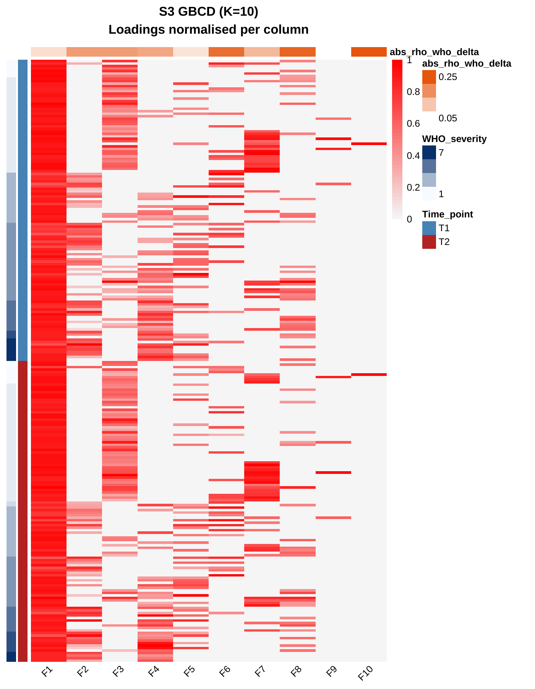

**S3 Asymmetric EBNMF** (K=15, auto). Non-negative L, signed F.
]

.pull-right[


**S2 Double point-exponential EBNMF** (K=14, auto). Sparse.

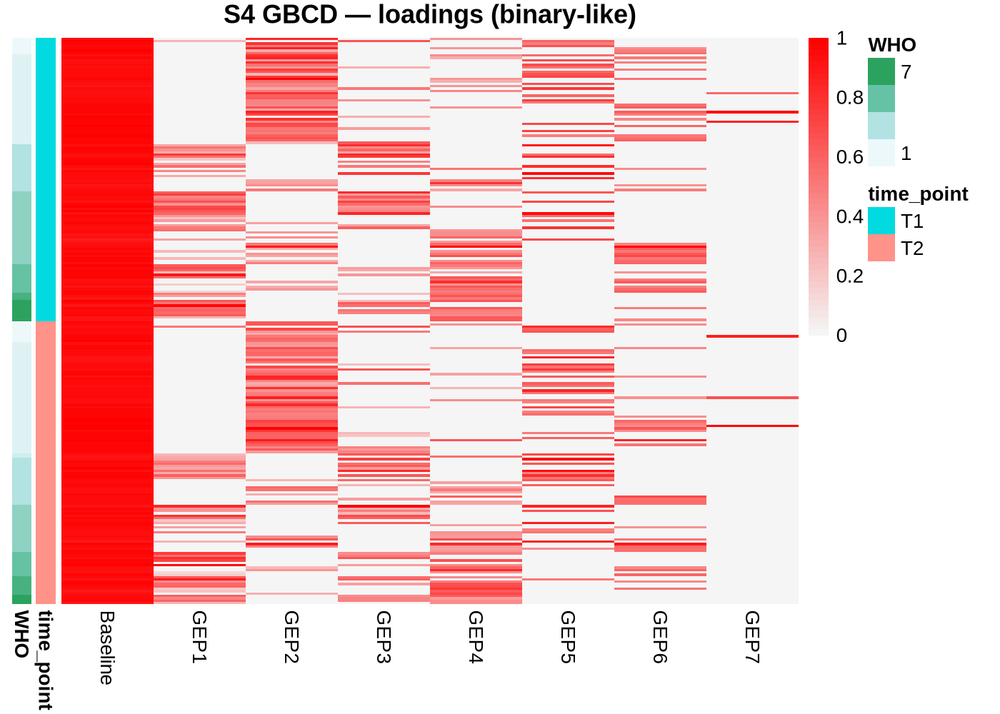

**S4 GBCD** (K=8, auto). Binary-like.
]

---

# Severity associations

All four variants recover a strong severity program:

| Variant | Best factor | Spearman $\rho$ (T1) | FDR |
|---------|-----------|---------------------|-----|
| S1 Standard NMF | F1 | +0.750 | <0.001 |
| **S2 Double point-exponential** | **F1** | **-0.819** | **<0.001** |
| S3 Asymmetric | F4 | +0.737 | <0.001 |
| S4 GBCD | F3 | -0.690 | <0.001 |


**Key observations:**

- **S2 (Double point-exponential) strongest** ( $|\rho| = 0.819$ ): auto K + learned sparsity → concentrated severity signal
- **S1 vs S2:** opposite sign reflects NMF sign ambiguity (both valid)
- **S4 (GBCD) weakest** ( $|\rho| = 0.690$ ): binary prior expects discrete subgroups, but severity is a continuum

---


# Double point-exponential: top protein weights per program

.center[
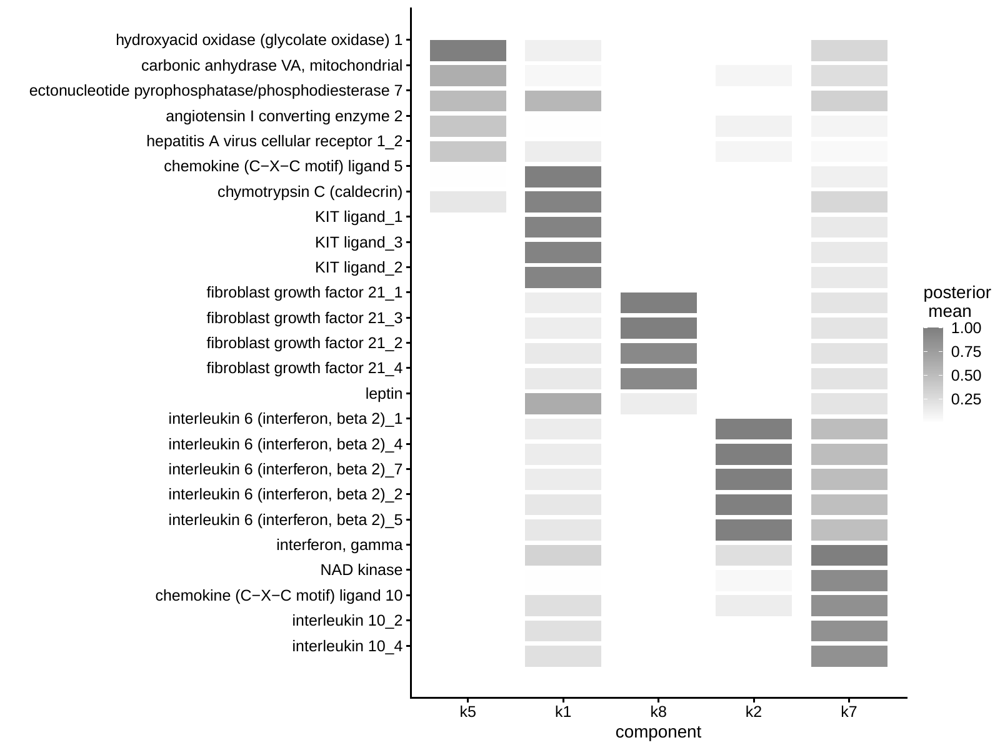
]

Top 10 proteins per factor (by $F_{jk}$ weight). Each column = one program; rows = top proteins. Reveals which proteins drive each program.

---

# All four variants: association summary

.center[
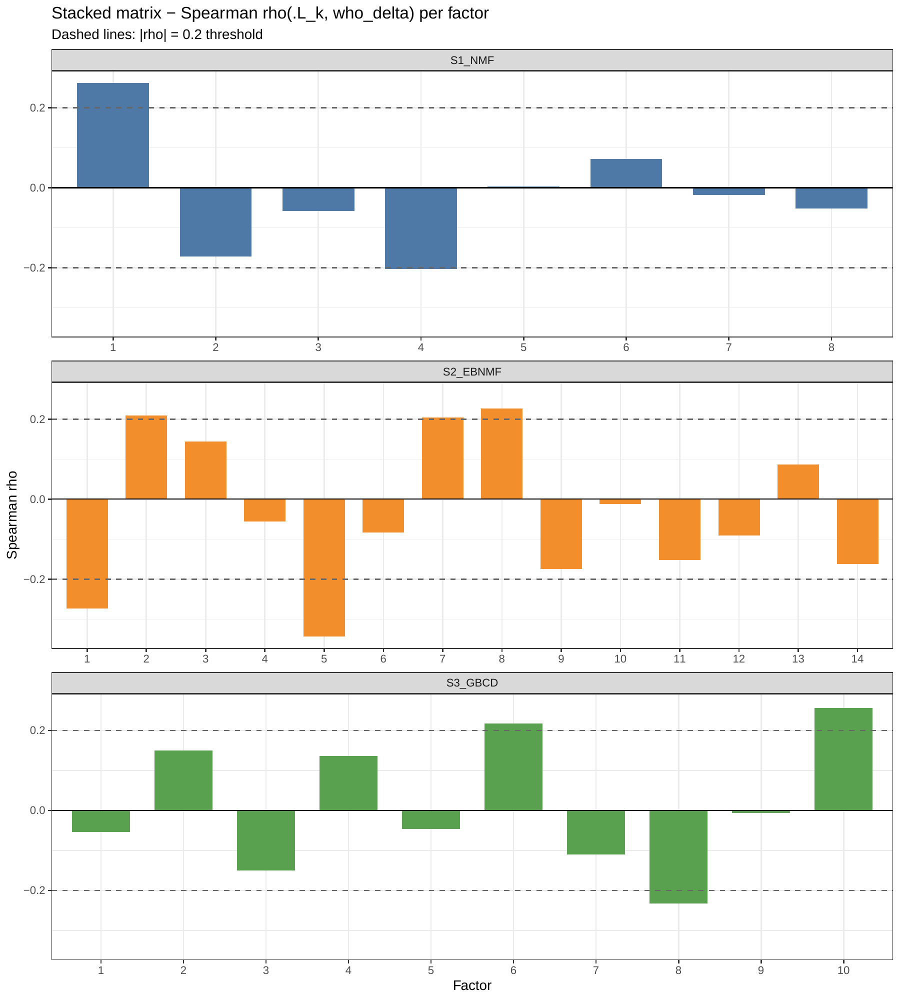
]

Spearman $\rho$ between each factor's T1 loading and T1 WHO severity, across all four NMF variants. All find a strong severity program; S2 (EBNMF) achieves the highest $|\rho|$.

---

# NMF on stacked data: strengths and limitations

.pull-left[
**What NMF does well:**

- Identifies **interpretable programs** — non-negative L and F have clear biological meaning
- EBNMF **auto-selects K** and learns sparsity per factor — no hyperparameter tuning
- Strong severity associations recovered ( $|\rho|$ up to 0.819)
- Programs can be annotated by top-weighted proteins
- Fast and scalable to large matrices
]

.pull-right[
**What stacking cannot answer:**

1. **Which programs are shared across time points?**
   Every factor spans T1 and T2 — no built-in distinction.

2. **How many shared vs. time-specific components?**
   NMF selects a total $K$, not $K_{\text{shared}} + K_{\text{T1}} + K_{\text{T2}}$.

3. **Time-specific programs may be diluted.**
   An admission-only signal competes for variance against time-stable programs.
]


**→ NMF excels at single-matrix decomposition. For multi-block structure, we need DIVAS.**

---
class: inverse, center, middle

# DIVAS
## Data Integration Via Analysis of Subspaces

---

# DIVAS: the idea

**Given** $B$ data blocks measured on the same $n$ samples, DIVAS decomposes each block's signal into:

- **Shared components** — present in multiple blocks
- **Individual components** — present in one block only


**How?** Each data block defines a linear space, finding an $n$-dim sample score vector is to find vectors lying in **intersections** of different spaces.

- E.g. T0 and T1 matrices: shared components are in intersection of 2 spaces
- Optimisation procedure to find these components
- Rotational bootstrap provides statistical inference on which are genuinely shared


---

# NMF stacking vs DIVAS

| | NMF on stacked matrix | DIVAS |
|---|---|---|
| Shared vs. individual | Not distinguished | Explicitly labelled |
| Component counts | Single total $K$ | $K_{\text{shared}}$, $K_{\text{indiv,1}}$, $K_{\text{indiv,2}}$ |
| Statistical inference | Bayesian | Bootstrap p-values |
| Input | User must choose how to stack* | Separate blocks; no stacking decision* |
| Sparsity | Done via EB* | no sparsity* |

\* These are philosophical differences (a schism?) between EBNMF and DIVAS

---

# DIVAS on COVID-19 proteomics

Treat T1 and T2 as **two blocks** (481 proteins × 120 patients each):

```r
library(DIVAS)
data_list <- list(T1 = t(Prot_T1), T2 = t(Prot_T2))

divas_res <- DIVASmain(
  datablock    = data_list,
  nsim         = 400,        # bootstrap simulations
  colCent      = TRUE,       # centre proteins within each block
  ReturnDetail = TRUE        # needed for getTopFeatures()
)
```


---

# DIVAS: rank decomposition

.pull-left[
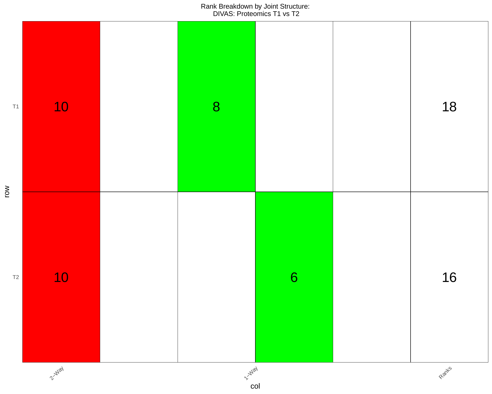
]

.pull-right[
**Reading this plot:**

- **Red (2-way):** 10 shared components present in both T1 and T2
- **Green (1-way):** 8 T1-individual + 6 T2-individual
- **Ranks column:** total signal rank per block (T1: 18, T2: 16)

DIVAS automatically determines how many components are shared vs. individual via rotational bootstrap — no user input needed.

This decomposition is the key output: it tells us the **structure of variation** before we look at any clinical associations.
]

---

# DIVAS: severity associations

.pull-left[
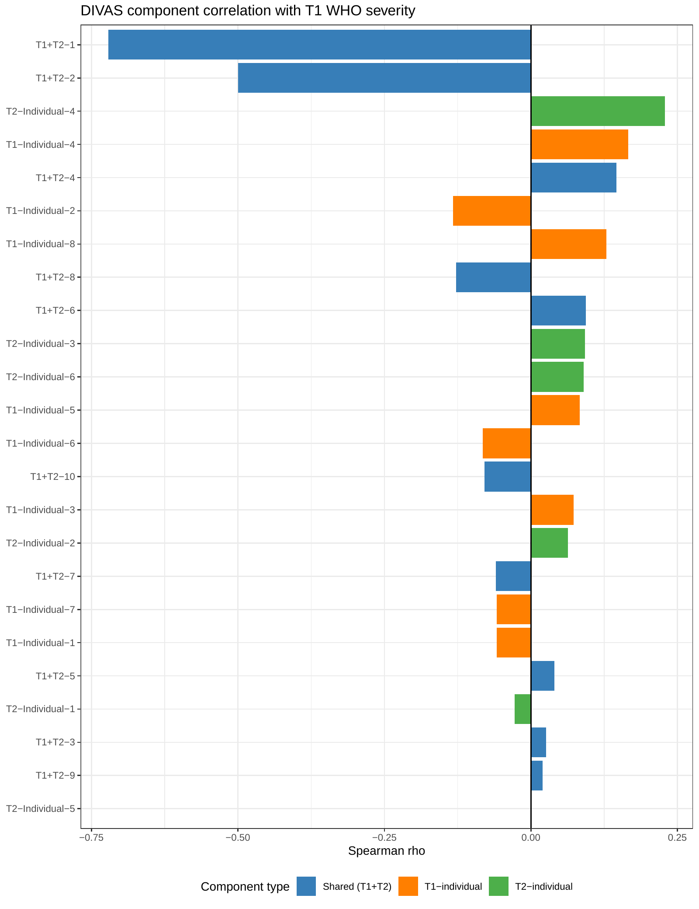

Spearman $\rho$ per component vs T1 severity. **Shared T1+T2-1** dominates ( $\rho = -0.721$, FDR < 0.0001). Individual components show no severity signal.
]

.pull-right[
| Component | Type | $\rho$ | FDR |
|-----------|------|--------|-----|
| **T1+T2-1** | **Shared** | **-0.721** | **<0.0001** |
| T1+T2-2 | Shared | -0.500 | <0.0001 |
| All indiv. | Individual | weak | >0.3 |

**Severity is time-stable** — only shared components associate with it.
]

---

# Interpreting individual components

**Method:** For each individual component, extract **top proteins** by loading weight
using `getTopFeatures()`, then annotate by known protein function.

```r
feats <- getTopFeatures(divas_res, compName = "T1+T2-1",
                        modName = "T1", n_top_pos = 10, n_top_neg = 10)
feats$top_positive   # proteins with highest positive loadings
feats$top_negative   # proteins with highest negative loadings
```

Individual components have **no severity association** (all FDR > 0.3) — severity is time-stable.
Their value lies in revealing **time-specific biology** invisible to stacking NMF.

---

# Individual components: admission-specific (T1)

.pull-left[
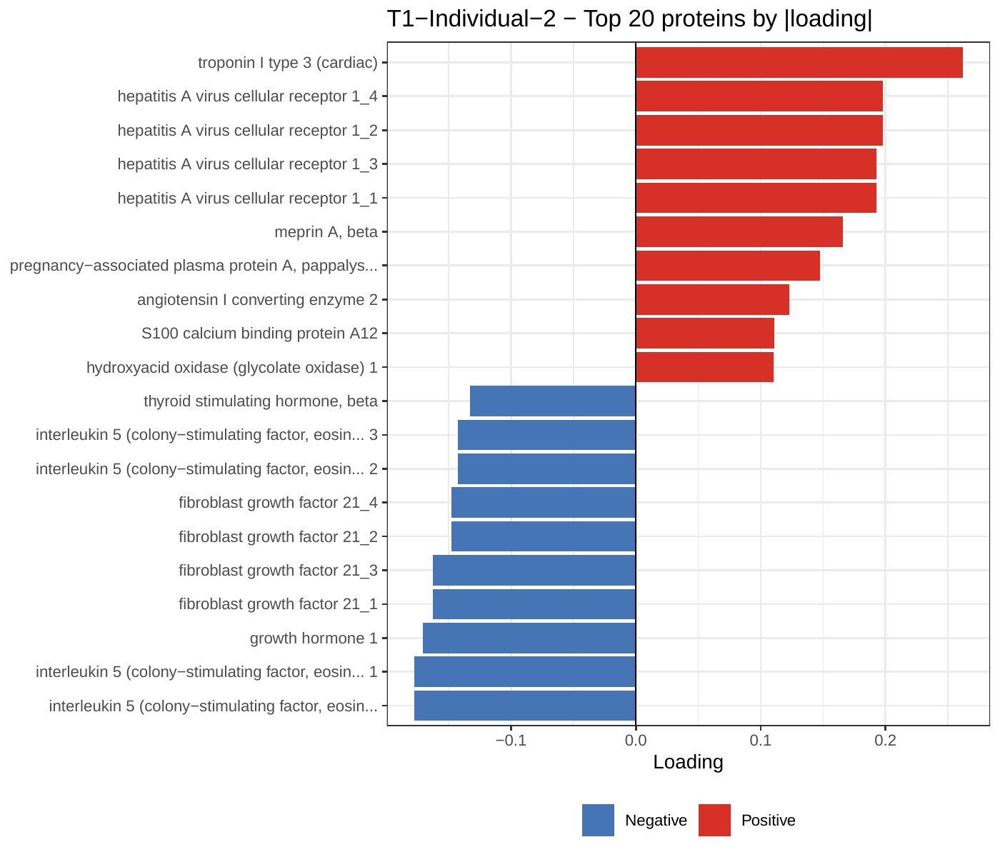

**T1-Indiv-2: Cardiac-renal injury.**
Troponin I, HAVCR1/TIM-1 (kidney injury) vs IL-5.
Acute organ damage at admission.
]

.pull-right[
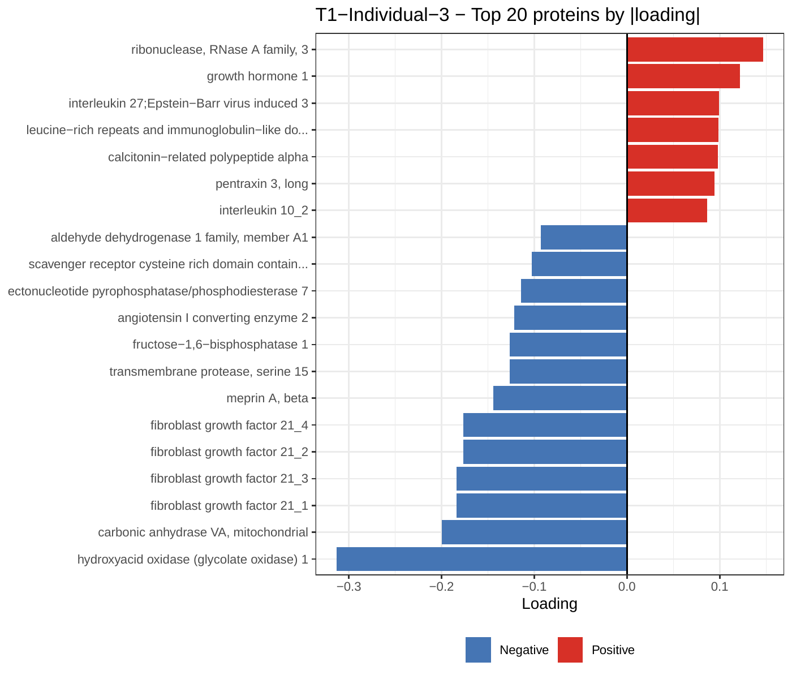

**T1-Indiv-3: Hepatic metabolic stress.**
HAO1 (liver peroxisomal), FGF21 (hepatokine).
Distinct from cardiac injury — a separate metabolic axis.
]

---

# Individual components: follow-up-specific (T2)

.pull-left[
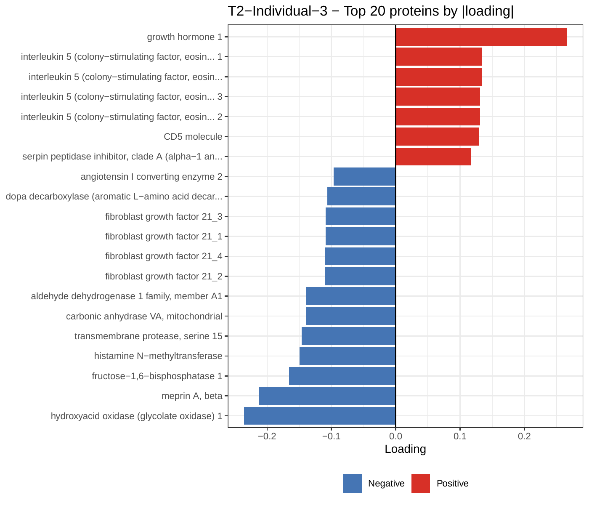

**T2-Indiv-3: Somatotropic recovery.**
GH1, IL-5 vs HAO1, meprin.
New axes emerge at follow-up centred on growth/recovery.
]

.pull-right[
**The biological picture:** (painted by Claude! --JD)

At **admission**, patients vary along:
- Acute cardiac/renal injury (Troponin I, HAVCR1)
- Hepatic metabolic stress (FGF21, HAO1)
- Immune activation (IFN-gamma, NCF2)

By **follow-up**, new axes emerge:
- Somatotropic recovery (GH1)
- Persistent inflammation (IL-6)
- Ongoing kidney injury (HAVCR1)

The time-stable severity program persists — but the **character** of the disease changes.

**Only DIVAS, not NMF, can formally separate these dynamics.**
]

---

# Summary: method comparison

| Method | K selection | Sparsity | Multi-block | Best for |
|--------|-----------|----------|------------|---------|
| Standard NMF | Fixed | Hyperparameter | No | Simple baseline |
| **EBNMF** (`flashier`) | **Auto (ELBO)** | **Learned (EB)** | No | Single-matrix, auto K |
| **GBCD** | Auto | Binary prior | No | Discrete membership |
| **DIVAS** | Auto (bootstrap) | None (SVD) | **Yes** | Shared vs. individual |


---

# Key references

.small[
- Willwerscheid, Carbonetto & Stephens (2025). "ebnm: An R Package for Solving the Empirical Bayes Normal Means Problem." *JSS*, 114(3).

- Liu, Carbonetto et al. (2025). "Dissecting tumor transcriptional heterogeneity from single-cell RNA-seq data by generalized binary covariance decomposition." *Nature Genetics*, 57, 263–273.

- Prothero et al. (2024). "Data integration via analysis of subspaces (DIVAS)." *TEST*.

- Sun, Marron, Lê Cao, Mao (2026). "DIVAS: an R package for identifying shared and individual variations of multiomics data." *bioRxiv*.
]


**R packages:**

```r
install.packages(c("ebnm", "flashier"))
remotes::install_github("stephenslab/gbcd")
devtools::install_github("ByronSyun/DIVAS_Develop/pkg", ref = "main")
```

---
class: inverse, center, middle

# Thank you!

### Questions?

.footnote[
Slides made with `xaringan`. Full handout: `EBNMF.md`
]
